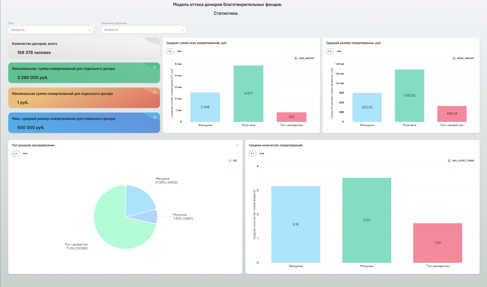

# donors_churn_prediction
Модель оттока доноров (Churn Prediction)  
## Цель: 
Определение доноров, которые с высокой вероятностью перестанут жертвовать в благотворительные фонды. Построение информативного дашборда по результатам предсказаний   

## Стек
Pandas, Scikit-learn, MLflow, Analytic Workspace.
Для предсказания оттока доноров мы будем использовать модель машинного обучения.
Дашборд будет строиться в Российской BI-системе Analytic Workspace.

## Исходные данные:
Имеются синтетические обезличинные  данные о сотнях тысяч платёжных транзаций, содержащих данные о платежах, донорах [тех, кто делает пожертвование], маркетинговых кампаниях фондов и т.д. 

Ссылка на датасет: https://disk.yandex.ru/d/hbslKtqXLZwwlw  
В датасете содержатся 4 csv-файла:  

1. **Пожертвования** - Таблица с пожертвованиями доноров.  
id - Идентификатор пожертвования;  
donor_id - Идентификатор донора (таблица "Доноры");  
purpose_id - Идентификатор цели сбора (таблица "Цели сбора");  
transaction_id - Идентификатор транзакции (таблица "Транзакции");  
recurring_id - Идентификатор рекуррентного платежа (платеж, который автоматически списывается каждый месяц с привязанной карты донора)  
status - Статус платежа  
1 - Новый (начата процедура оформления платежа пожертвования)  
2 - Авторизованный (пользователь ввел одноразовый код от своего банка, авторизовав платеж)  
3 - Завершенный (платеж успешно прошел)  
4 - По пожертвованию был оформлен возврат  
5 - Отклоненный (платеж после авторизации был отклонен банком. например, нет денег на счете)  
when - Дата и время пожертвования  
amount и amount_total - Сумма (с удержанной возможной комиссией) и общая сумма платежа  
category - Тип оплаты (карта, СБП и т.д.)  
gateway - Платежная система  
device_type - Тип устройства, с которого оформлялось пожертвование  
os - Операционная система на устройстве  

2. **Транзакции** - Таблица с платежными транзакциями  
id - Идентификатор транзакции   
when - Дата и время транзакции  
amount - Сумма платежа  
currency - Валюта платежа  
ipcountry - Страна, определенная по IP адресу  
ipregion - Регион, определенный по IP адресу  

3. **Доноры** - Информация о донорах  
id - Идентификатор донора  
sex - Пол донора  

4. **Цели сборов** - Информация о целях сборов благотворительных фондов  
id - Идентификатор цели сбора  
fund_id - Идентификатор благотворительного фонда  

## Обработка и подготовка данных
В репозитории присутствуют 2 ipynb файла.  
churn_data_processing.ipynb  -  предобработка данных, конструирование признаков перед загрузкой в модель данных Bi-системы Analytic Workspace (Далее - AW).  
ml_churn_gb_final.ipynb  - обучение модели машинного обучения на данных, загруженных из модели AW. Выгрузка модели машинного обучения в mlflow.  
Обработка исходного датасета, состоящего из 4-х файлов выполнялась в Jupyter-notebook с помощью Python и библиотеки Pandas. Этот способ был выбран по причине его удобства, скорости обработки, а так же возможности оставлять в коде развернутые комментарии и заголовки.
В файле churn_data_processing.ipynb  была выполнена загрузка данных из исходных файлов, обработка, очистка, преобразование, группировка данных. Были сконструированы новые признаки на основе имеющихся данных. Результат этой обработки был выгружен в csv файл.
При формировании признаков для дальнейшей их передачи на вход в модель машинного обучения пришлось отставить только те, по которым можно было сделать группировку по donor_id либо вычислить по ним новые признаки с группировкой по donor_id. Остальные пришлось отбросить (например id благотворительных фондов т.к. у доноров этих фондов могло быть по несколько штук и разных).
Этот CSV файл подключался в качестве источника данных к модели AW.  

Далее в модели AW мы создавали 3 вычисляемых поля, которые в дальнейшем послужат новыми признаками для модели машинного обучения:  
1.	'current_date_diff_coeff' - это коэффициент временной разницы между последней успешной транзакцией донора и датой на которую мы хотим сделать прогноз. Из “текущей” даты (01.07.2021) вычитаем дату последней успешной транзакции (‘ last_transaction_date’) и делим всё это на среднее количество дней между двумя успешными транзакциями донора (колонка 'mean_date_diff'). Это поле будет признаком для предсказания оттока на текущий момент.
“Текущая” дата была представлена в целочисленном виде (737972) как после обработки методом toordinal() из Python.  

2.	'current_date_diff_coeff_month' – это аналогичный коэффициент, но при его расчете к “текущей” дате прибавляется 30 дней. Это поле будет признаком для предсказания оттока через месяц.  

3.	'current_date_diff_coeff_quarter' – признак для предсказания оттока через 1 квартал.  

При расчете к “текущей” дате прибавляем 90 дней.  

После этого данные из модели AW подтягивались в датафрейм  (файл ml_churn_gb_final.ipynb  ), на котором происходило обучение модели градиентного бустинга. Модель проверялась по основным метрикам и выгружалась в mlflow.

##  Модель машинного обучения
В AW была создана еще одна модель данных, в которой в дальнейшем были выполнены предсказания оттока доноров  для трех разных временных отметок. Условно говоря: “отток сейчас”, “отток через 1 месяц” и “отток через 1 квартал”.  
Все 3 предсказания были выполнены в рамках 1 модели AW с помощью одной и той же ранее обученной модели машинного обучения, но с разными наборами признаков. Для каждой временной отметки в модель машинного обучения подавался свой соответствующий 'current_date_diff_coeff…’  
Все 3 предсказания записывались в данную модель AW в виде отдельных полей.  
В качестве модели машинного обучения был выбран Градиентный бустинг. Популярный в наши дни алгоритм, отлично решающий задачи классификации.  
Изначально была идея заморочиться с подбором параметром с помощью GreadSearch и кросс-валидации, но модель сходу выдала фактически идеальные метрики и дополнительный подбор параметров был признан нецелесообразным.
В принципе такой результат неудивителен, т.к. данных у нас достаточно много, а целевая переменная очень легко просчитывается исходя из той логики по которой она нами и была изначально заложена в обучающий набор данных (прямая зависимость от количества дней прошедших с момента последней успешной транзакции и среднего количества дней между транзакциями).

## Дашборд

Далее на базе этой модели AW был построен дашборд (https://aw-demo.ru/public/dashboard/0RHLH1sCn3_GgAPRJgzrFWF98IS3pK3X).  
Он состоит из 2-х вкладок и логически разделен на 2 части.  
1-я вкладка: Статистика, на которой представлены метрики, которые мы можем вычислить исходя из тех данных, что у нас есть. Тут нужно отметить, что метрики представлены в основном в разрезе пола доноров т.к. никакой иной персональной информации о них у нас нет (ни возраста, ни образования, ни профессии и т.д.). Более того и пол указан лишь у 30% доноров.

2-я вкладка: Прогнозирование. Тут мы можем посмотреть графическое представление результатов прогноза моделью машинного обучения.
На обеих вкладках представлены 2 фильтра. Пол и Наличие подписки на реккурентные пожертвования, что позволяет взглянуть на статистику и прогноз в разрезе этих переменных. 

Так же стоит отметить, что ряд полей-признаков оказался фактически не задействован в этом проекте. Изначально они добавлялись в датасет т.к. не было ясно будет от них польза или нет. Ну а в дальнейшем было решено их оставить.  Возможно позже к ним потребуется обратиться с какими-то неочевидными на сегодня вопросами.

## Выводы
В целом по результатам работы модели машинного обучения можно сделать следующий вывод:
модель прогнозирует увеличение оттока доноров с течением времени. Что абсолютно очевидно, учитывая те исходные данные, которые она имеет, а именно: время идет, количество дней увеличивается, а новых записей о новых транзакциях за прошедший период не прибавляется.

